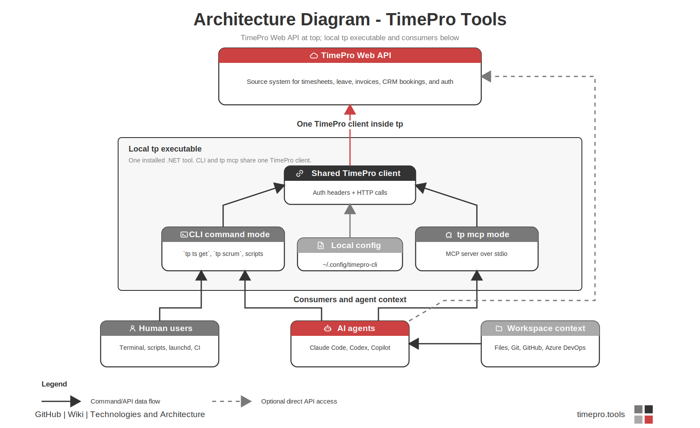

# SSW TimePro CLI + MCP

> CLI-first tool with MCP support for managing [SSW TimePro](https://www.sswtimepro.com/) timesheets. Built for AI agents (Claude Code, Codex, VS Code Copilot) and human users.
>
> This project uses the existing TimePro API with your own credentials.

SSW TimePro is a time tracking and invoicing system. This CLI makes it fast to view, create, and manage timesheets from the terminal — and exposes the same capabilities to AI agents via [MCP](https://modelcontextprotocol.io/).

## What it does

- **Week View** — Compact or detailed view of your timesheets with totals, billable hours, and missing days
- **Timesheet CRUD** — Create, update, delete timesheets with rate checking and lock detection
- **Suggested Timesheets** — View and accept suggested timesheets to keep accuracy stats high
- **CRM Bookings** — See your appointments from the CRM calendar
- **Leave Management** — Create, list, and cancel EasyLeave requests
- **Repo Mapping** — Map git repos to clients/projects; auto-detects via path or remote URL, with git worktree support; optional `--issues-repo` for projects whose issues live in a different GitHub repo than the code
- **Daily Scrum** — Generate an SSW-format daily scrum email from timesheets, CRM bookings and GitHub activity, with AutoScrum-inspired `--smart` selection, overridable per-tenant/client templates, rich-text / markdown / plain clipboard support and an interactive copy mode
- **Location Defaults** — Set WFH days so location is auto-applied when creating timesheets
- **CSV Export** — Export timesheets for tax reports or analysis
- **Skills Generation** — Generate agent skill files with project context and `gh` commands
- **MCP Server** — Exposes timesheet, lookup, leave, accounting, and prepaid tools for AI agents via stdio transport

## Prerequisites

- [.NET 10 SDK](https://dotnet.microsoft.com/download/dotnet/10.0)
- A TimePro account with API access
- (Optional) [GitHub CLI](https://cli.github.com/) for issue/PR references in timesheets

## Quick Start

### 1. Install as global tool

The install script grabs the latest release and installs (or updates) the `tp`
global tool. It first checks that the .NET 10 SDK is present. Re-run it any time
to upgrade to the newest release.

**macOS / Linux:**

```bash
curl -fsSL https://raw.githubusercontent.com/SSWConsulting/TimePro.Tools/main/scripts/install.sh | bash
```

**Windows (PowerShell):**

```powershell
irm https://raw.githubusercontent.com/SSWConsulting/TimePro.Tools/main/scripts/install.ps1 | iex
```

This makes the `tp` command available system-wide. If `tp` isn't found
afterwards, add the .NET tools directory (`~/.dotnet/tools`, or
`%USERPROFILE%\.dotnet\tools` on Windows) to your `PATH` and open a new terminal.

Check the installed version, active tenant/user, and update status any time with:

```bash
tp info
```

Use `tp info --no-update-check` when you need a local-only check, or
`tp info --detailed` for install history and config diagnostics.
For scripts that need only the version string, `tp --version` prints just that.

Check whether a newer GitHub Release is available:

```bash
tp --check-update
tp --check-version
tp --whats-new
tp --whats-new --url
```

To uninstall:

```bash
dotnet tool uninstall -g SSW.TimePro.Cli
```

> Building from source instead? See
> [Local development](#local-development-build-from-source) below.

### 2. Authenticate

```bash
tp login --tenant ssw
```

This sets your tenant and prompts for an API token. To get your token:
1. Visit `https://{tenant}.sswtimepro.com/b/admin/api-key`
2. Copy the API key

For non-interactive login (CI, scripts):

```bash
tp login --tenant ssw --token YOUR_API_KEY --api-url https://api.sswtimepro.com
```

Your employee ID and name are auto-detected on login. Credentials are stored at `~/.config/timepro-cli/tenants/{tenant}.json`.

### 3. View your timesheets

```bash
tp ts get --week           # This week (compact view)
tp ts get --week --detailed # With full descriptions, invoices, lock status
tp ts get --week -1        # Last week
tp ts get 2026-03-12       # Specific date
```

## CLI Reference

| Command | Description |
|---------|-------------|
| `tp login --tenant ID` | Authenticate with a TimePro tenant |
| `tp logout` | Remove stored credentials |
| `tp tenant set ID` | Switch active tenant |
| `tp tenant info` | Show active tenant details |
| `tp tenant list` | List all stored tenants |
| `tp ts get [DATE]` | View timesheets (supports `--week`, `--detailed`, `--json`) |
| `tp ts create` | Create a new timesheet (see options below) |
| `tp ts update ID` | Update a timesheet (partial — only specified fields) |
| `tp ts delete ID` | Delete a timesheet |
| `tp ts suggest [DATE]` | View suggested timesheets |
| `tp ts accept ID` | Accept a suggested timesheet |
| `tp ts export` | Export timesheets to CSV |
| `tp ts check` | Leave-aware week validation: gaps, overlaps, missing descriptions, under/over hours; approved leave/holidays count as covered (`--week N`, `--json`) |
| `tp ts copy` | Copy timesheets from one day to another |
| `tp bk list` | List CRM bookings/appointments |
| `tp leave list` | List leave entries (`--filter UPCOMING\|PAST`) |
| `tp leave balance` | Show leave-usage signal (`--emp-id`): days since last leave + hours taken in last 12 months |
| `tp leave create` | Create a leave request (see options below) |
| `tp leave cancel ID` | Cancel a leave request (`--reason`) |
| `tp cl search QUERY` | Search for clients |
| `tp proj list --client ID` | List projects for a client |
| `tp proj recent` | Surface projects you've recently logged time against (likely picks for new entries) |
| `tp rate get --client ID` | Get billing rate (with expiry warnings) |
| `tp iter list --project ID` | List iterations/sprints for a project |
| `tp summary` | Project hours breakdown (`--week`, `--month`, `--from/--to`) |
| `tp report` | Monthly summary with billable %, WFH breakdown |
| `tp loc info [--date D]` | Show location defaults / check a specific date |
| `tp loc set LOC --day D` | Set WFH day defaults |
| `tp map set PATH` | Map a repo path to a client/project |
| `tp map detect` | Detect mapping for current directory |
| `tp map list` | List all repo mappings |
| `tp map remove PATH` | Remove a repo mapping |
| `tp query` | Query timesheets across employees/projects (`--group-by`, `--json`) |
| `tp scrum` | Generate a daily scrum email from timesheets + GitHub (`--smart`, `--project`, `-i`, `--copy --format rich\|markdown\|plain`, `--json`, custom templates) |
| `tp info [--detailed] [--no-update-check]` | Show version, active tenant/user, and update status |
| `tp --check-update` | Check the latest GitHub Release and print update instructions |
| `tp --check-version` | Alias for `tp --check-update` |
| `tp --whats-new [--url]` | Show embedded Markdown release notes, or print the latest known release-notes URL |
| `tp skills create TARGET [--global] [--accounting]` | Generate unified agent skill files (`--accounting` for the accountant CLI skill) |
| `tp user me` | Show current user info |
| `tp user list [QUERY]` | List users and match names/emails to EmpIDs (`--emp-id`, `--email`, `--all`, `--json`) |
| `tp user get EMP_ID` | Show focused user details by EmpID (`--json`) |
| `tp blog list` | Latest blog posts (`--mine`, `--limit N`, `--all`) |
| `tp mcp` | Start MCP server (stdio); `--tenant NAME` binds the session to a specific tenant config without changing the global active tenant |
| **Accountant (read-only)** | See [`docs/accounting.md`](docs/accounting.md) |
| `tp invoice list / get / lines / timesheets / receipts` | Invoices |
| `tp receipt list / get / outstanding` | Receipts + aged debtors |
| `tp creditnote list --client ID` | Credit notes |
| `tp product list / get / discounts` | Sale products / SKUs |
| `tp rate list --client ID` | Configured rates across all employees |
| `tp client outstanding` | Clients with unbilled time |
| `tp client billable-work` | Clients above a billable-work threshold, with first invoice date |
| `tp unbilled list --client ID` | Unbilled timesheets for a client |
| `tp recurring list / get` | Recurring invoice templates |
| `tp prepaid summary / status INVOICE_ID` | Prepaid drawdown totals / PDF report |

All read commands support `--json` for machine-readable output. All write commands support `--yes` to skip confirmation prompts.

**`--json` error contract:** on failure, the command emits a structured envelope to **stdout** so stdout stays valid JSON even when an API call fails — `{"error":{"code":<int|null>,"message":"...","detail":<string|null>}}` (all keys always present) — and exits non-zero. Human-readable error/warning text always goes to **stderr**, so it never corrupts the JSON stream.

### Aliases

Every command group has a short alias:

| Full | Alias |
|------|-------|
| `tp timesheet` | `tp ts` |
| `tp booking` | `tp bk` |
| `tp leave` | `tp lv` |
| `tp client` | `tp cl` |
| `tp project` | `tp proj` |
| `tp location` | `tp loc` |
| `tp iteration` | `tp iter` |
| `tp invoice` | `tp inv` |
| `tp receipt` | `tp rcpt` |
| `tp creditnote` | `tp cn` |
| `tp product` | `tp prod` |

### Creating Timesheets

```bash
tp ts create \
  --client NWIND \
  --project 1I776Q \
  --date 2026-03-16 \
  --start 09:00 \
  --end 18:00 \
  --less 60 \
  --description "Added product search API endpoint — PR #42 · #108" \
  --location Home \
  --billable B \
  --yes
```

When creating timesheets:
- **Category** is auto-resolved from repo-mappings or recent timesheets (past 14 days); pass `--category` to override
- **Rate** is checked automatically; you'll get a warning if it's expired or expiring soon
- **Location** defaults to your WFH settings if not specified
- **Locked timesheets** (invoiced) only allow location and description changes
- **Duplicate detection** — if a timesheet already exists for the time slot, you'll get a clear error suggesting `tp ts update` instead
- **API error details** — validation errors now show the specific field and message from the API

### Leave Management

```bash
# List upcoming leave
tp leave list --filter UPCOMING --json

# Create a full-day leave request
tp leave create --start 2026-03-30 --end 2026-03-30 --type 1 \
  --note "Returning from MVP Summit" --yes

# Create with approver and CC
tp leave create --start 2026-03-30 --end 2026-03-30 --type "Annual Leave" \
  --note "Returning from MVP Summit" \
  --approved-by "approver@northwind.example" \
  --cc "notify1@northwind.example,notify2@northwind.example" --yes

# Cancel a leave request
tp leave cancel <ID> --reason "Plans changed" --yes
```

Leave create options:
- `--type` accepts a numeric ID (e.g., `1`) or name (e.g., `"Annual Leave"`)
- `--approved-by` sets the approver's email
- `--cc` comma-separated list of emails to notify
- `--half-day` for partial day requests (start and end date must be the same)
- `--start-time` / `--end-time` override defaults (09:00/18:00)

### Week View

Compact view shows one line per timesheet with totals:

```
 Week of Mar 10 - Mar 14, 2026
─────────────────────────────────────────────────────────────────────
 Mon 10 │ 8.0h │ Northwind  Northwind Traders  4.0h  Home    B
         │      │ Northwind  Internal tooling   4.0h  Home    W
 Tue 11 │ 8.0h │ Northwind  Northwind Traders  8.0h  Home    B
 Wed 12 │ 0.0h │ No timesheets
 Thu 13 │ 8.0h │ Northwind  Northwind Traders  8.0h  Office  B
 Fri 14 │ 8.0h │ Northwind  Planning           8.0h  Office  W
─────────────────────────────────────────────────────────────────────
 Total: 32.0h / 40.0h  │  Billable: 20.0h  │  Missing: Wed
```

Detailed view (`--detailed`) shows full descriptions, invoice info, and suggested timesheets.

### Repo Mapping

Map repositories to clients/projects so AI agents know what to bill:

```bash
tp map set ~/Developer/git/Northwind/traders-app \
  --remote github.com/Northwind/traders-app \
  --client NWIND --project 1I776Q --project-name "Northwind Traders" \
  --category WEBDEV

tp map set ~/Developer/git/Northwind/traders-api \
  --client NWIND --project 1I776Q --project-name "Northwind Traders API" \
  --category WEBDEV
```

The `--category` is recommended — it enables `tp ts create` to auto-resolve the category without `--category` on every call. When updating an existing mapping, omitting `--category`, `--project-name`, `--remote`, or `--issues-repo` preserves their current values. `~`-prefixed and absolute paths are deduped against each other, so re-running `set` on the same repo updates in place rather than creating a duplicate entry.

**Issues repo**: when a project's issues/PRs live in a **different** GitHub repo than the code (for example the code sits in a sandbox repo but issues are tracked in the main product repo), add `--issues-repo owner/repo`. This is what `tp scrum` uses to resolve PR and issue references:

```bash
tp map set ~/Developer/git/Northwind/traders-mobile \
  --client NWIND --project 1I776Q \
  --issues-repo Northwind/traders-app
```

`tp map list` shows all mappings including their category and issues repo:

```
┌──────────────────────┬────────┬─────────┬────────────────────┬──────────┬─────────────────────────┐
│ Path / Remote        │ Client │ Project │ Name               │ Category │ Issues repo             │
├──────────────────────┼────────┼─────────┼────────────────────┼──────────┼─────────────────────────┤
│ ~/Developer/git/Nort │ NWIND  │ 1I776Q  │ Northwind Traders  │ WEBDEV   │ —                       │
│ hwind/traders-app    │        │         │                    │          │                         │
│ ~/Developer/git/Nort │ NWIND  │ 1I776Q  │ Northwind Traders  │ WEBDEV   │ Northwind/traders-app   │
│ hwind/traders-mobile │        │         │                    │          │                         │
└──────────────────────┴────────┴─────────┴────────────────────┴──────────┴─────────────────────────┘
```

Detection supports:
- **Exact path** — `~/Developer/git/Northwind/traders-app`
- **Glob patterns** — `~/Developer/git/Northwind/*`
- **Git remote URL** — `github.com/Northwind/traders-app`
- **Git worktrees** — Codex/Claude worktrees at `~/.codex/worktrees/` or `~/.claude-worktrees/` resolve to the main repo automatically

```bash
tp map detect  # Shows matched client/project for current directory
```

### Location Defaults

Set which days you work from home:

```bash
tp location set Home --day Mon,Tue
tp location info                      # Show defaults
tp location info --date 2026-03-16    # Check a specific date
```

When creating timesheets, location is auto-applied based on the day of week.

### Skills Generation

Generate agent skill files for a project:

```bash
tp skills create .agents                         # Generate unified skills for this project
tp skills create .claude --global                # Generate unified skills under global config
tp skills create .agents --accounting            # Also generate the accounting CLI skill
```

Generated skills use one format for Claude, Codex, and `.agents` installs:
- Each skill is written to `skills/<name>/SKILL.md`.
- YAML frontmatter includes `name`, `description`, and `allowed-tools`.
- Deterministic read-only commands are listed in a plain `Run these first` bash block.
- No load-time command execution syntax is emitted.

The generated skills include:
- `tp info --json` as the first health/update check
- Quick reference for all `tp` commands
- Workflow for entering a full week of timesheets
- `tp project recent --json` guidance to pick the likely project first
- `gh` commands pre-filled with the repo slug for issue/PR lookup
- Description format guide with PR and issue number examples
- Project context (client, project, GitHub repo) auto-detected from repo mapping

### Summary & Report

Quick overview of where your time goes:

```bash
tp summary --week -1           # Last week's hours by project
tp summary --month             # This month to date
tp summary --from 2026-01-01 --to 2026-03-31  # Custom range

tp report                      # This month: billable %, WFH breakdown, projects
tp report --month -1           # Last month
```

### Week Validation

Check for gaps before submitting timesheets:

```bash
tp ts check                    # This week
tp ts check --week -1          # Last week
tp ts check --week --json      # Machine-readable, per-day breakdown
```

Checks for: missing days, under/over hours, overlapping entries, missing descriptions, unaccepted suggestions. Returns exit code 1 when errors are found (CI-friendly).

**Leave-aware:** approved leave and public holidays count toward coverage, so a full-day leave day is reported as covered (never an error) and a partial-day leave only expects the remaining hours. The `--json` output carries a per-day `covered` / `coverReason` (`logged`, `leave-full`, `leave-partial`, `holiday`, `missing`), `leaveHours` / `leaveType`, plus a top-level `allCovered` flag.

### Copy Timesheets

Duplicate a day's timesheets to another day (e.g., "Tuesday was the same client as Monday"):

```bash
tp ts copy --from 2026-03-10 --to 2026-03-11 --yes
tp ts copy --from 2026-03-10 --to 2026-03-11 --keep-description --yes
```

### Querying Timesheets

Search timesheets across employees, clients, and projects with flexible grouping:

```bash
# Who worked on Northwind this FY? (grouped by employee)
tp query --client NWIND --project 1I776Q --from 2024-07-01 --to 2025-06-30

# All Northwind projects by hours (grouped by project)
tp query --client NWIND --from 2024-07-01 --to 2025-06-30 --group-by project

# Flat view with pagination
tp query --client NWIND --group-by none --limit 20 --page 2

# Export raw JSON for analysis
tp query --client NWIND --project 1I776Q --from 2024-07-01 --to 2025-06-30 --json > northwind-fy25.json
```

Grouping modes: `employee` (default), `project`, `client`, `none` (flat table with pagination).

### Daily Scrum

Generate an SSW-format daily scrum email from your timesheets, CRM bookings and GitHub activity — no more hand-assembling yesterday's merged PRs every morning.

```bash
tp scrum                            # Styled terminal view of today's scrum
tp scrum --json                     # Structured output for agents / scripts
tp scrum --html                     # HTML body (for emailing / piping)
tp scrum -i                         # Interactive: r/m/p to copy rich/markdown/plain, q to quit
tp scrum --copy --format rich       # Render & copy as RTF (Outlook / Apple Mail / Gmail)
tp scrum --copy --format markdown   # Copy with [#1234](url) link syntax
tp scrum --copy --format plain      # Copy with URLs spelled out inline
tp scrum --date 2026-04-09          # Generate for a specific date
tp scrum --smart                    # AutoScrum-inspired selection (see below)
tp scrum --project 1I776Q           # Include project(s); repeatable / comma-separated; overrides
tp scrum --project 1I776Q,1I776R    #   auto-detection so you can scrum projects not logged yet
tp scrum --template-md-only         # Print the raw markdown template (no data) for an agent to fill
tp scrum --template-html-only       # Print the raw HTML template
tp scrum --internal                 # Force internal daily scrum format
tp scrum --external                 # Force client-facing format
tp scrum --set-trello-url URL       # Save a Trello URL for the internal block (one-off)
```

**How it works**:

- **Today** = open PRs authored by you in the project's issues repo.
- **Yesterday** = the last *working day you logged the same project*, not literal calendar yesterday. If your last day on this project had no merged PRs, it bleeds back up to 7 days to surface PRs that shipped between visits.
- **Internal vs external** — classified from today's CRM bookings: any non-SSW client booking or timesheet → external format; all-SSW → internal format with the extra block (days until next client booking, Trello URL, "joined scrum meeting" checkbox). Override with `--internal` / `--external`.
- **Issues repo** — resolved via the `--issues-repo` field on your repo mapping (falls back to the `--remote` URL for plain `github.com/org/repo` patterns).
- **Timesheet notes** — intentionally kept out of the rendered bullets (too noisy), but exposed in `--json` under `yesterdayNotes` / `todayNotes` so AI agents can use them as enrichment context via the companion `/daily-scrum` Claude skill.

**Smart selection (`--smart`)** — the spiritual successor to the original [SSW AutoScrum](https://github.com/AwesomeBlazor/AutoScrum). It sorts your PRs/assigned issues into **Yesterday / Today / Blockers** with these rules:

- **In-progress lookback** — an open item counts as *yesterday* if you last touched it within the last 14 days (`scrum.yesterdayLookbackDays`), not just on the literal previous day. This keeps ongoing work visible across gaps and on the **first day of a new sprint**, where the previous day inside the sprint is empty.
- **Configurable cutoff** — `scrum.cutoffTime` (in `~/.config/timepro-cli/config.json`, e.g. `"cutoffTime": "09:00:00"`; default = midnight) is the yesterday/today boundary. Work completed **before** it → Yesterday (done); **after** it (this morning) → Today (done) — so a PR merged at 09:30 before a 10:00 stand-up isn't lost.
- **Weekend-aware** — a Monday scrum's "yesterday" spans back through Saturday/Sunday to the previous work day.
- **Blockers** — items labelled `blocked` (or draft PRs) surface in their own section.

**Custom templates** — override the rendered markdown/HTML body with your own (e.g. a French scrum for a Europe tenant). Drop a file in `~/.config/timepro-cli/`, resolved most-specific first:

```
daily-scrum.tenant.{tenantId}.client.{clientId}.{md|html}   # tenant + client
daily-scrum.tenant.{tenantId}.{md|html}                     # tenant
daily-scrum.{clientId}.{md|html}                            # client
daily-scrum.{md|html}                                       # global
                                                            # (else built-in default)
```

Templates own all the wording; the CLI substitutes `{{yesterday}}`, `{{today}}`, `{{blockers}}`, `{{date}}`, `{{client}}`, internal-block data, plus `{{#section}}…{{/section}}` / `{{^empty}}…{{/empty}}`. Use `--template-md-only` / `--template-html-only` to print the raw template so an agent can fill it from sources outside TimePro (pair with `--json`).

**Clipboard notes**:

- Rich text on macOS uses `textutil` → `pbcopy -Prefer rtf` with an explicit UTF-8 declaration so emoji and em-dashes survive pasting into Outlook, Apple Mail and Gmail.
- On Linux/Windows, rich text degrades to plain text automatically.
- OSC 8 hyperlinks are embedded in the styled terminal output — in modern terminals (iTerm2, Ghostty, WezTerm, Windows Terminal, VS Code) the `#1234` references are clickable.

Example output (client-facing, on the day after shipping a few PRs):

```
Hi team,

Yesterday I worked on:
- ✅ Done – PBI – Product search: add category facets #142
- ✅ Done – PBI – Validate inventory stock-level env vars #138
- ✅ Done – PBI – Guard checkout API against missing shipping address #135

Today I'm working on:
- PBI – Order history: paginate and expose CSV export #147

<This email was sent as per https://my.sugarlearning.com/SSW/items/8291>
```

### Blog Posts

See what your colleagues have been writing:

```bash
tp blog list                   # Latest 10 posts
tp blog list --mine            # Your own posts only
tp blog list --limit 5 --all   # Include former employees
```

## MCP Server

The MCP server exposes TimePro data to AI agents via stdio transport. Current tool groups include:

| Group | Examples |
|-------|----------|
| Timesheets | Get, create, update, delete, suggested timesheets, accept suggestions, list iterations, `check_week` (leave-aware weekly coverage) |
| Lookup | Search clients, list projects, get client rate, CRM bookings, location and repo mapping |
| Leave | List EasyLeave entries (optionally filtered by `empId`), `get_leave_balance` (days since last leave + 12-month hours) |
| Accounting | Invoices, receipts, credit notes, products/SKUs, client rates, unbilled time, recurring invoices |
| Reporting | Timesheet queries, current user, categories, billable types, locations, project summaries, prepaid drawdown status |

**Tenant resolution:** the MCP server uses the active tenant (`tp tenant set`). Pass `--tenant NAME` in `args` to pin a session to a specific tenant config without changing the global active tenant. If no active tenant is set and exactly one tenant config exists, the server defaults to that single tenant — so a single-tenant install works out of the box.

### Claude Code

Add to `~/.claude/settings.json`:

```json
{
  "mcpServers": {
    "timepro": {
      "command": "tp",
      "args": ["mcp"]
    }
  }
}
```

Then ask Claude things like:
- "What are my timesheets for this week?"
- "Create a timesheet for today — I worked on the Northwind Traders app"
- "Accept the suggested timesheet for Monday"
- "What's my billing rate for Northwind?"

### VS Code (Copilot / Continue)

Add to `.vscode/settings.json` or user settings:

```json
{
  "mcp": {
    "servers": {
      "timepro": {
        "command": "tp",
        "args": ["mcp"]
      }
    }
  }
}
```

### Codex (OpenAI CLI)

Add to your Codex MCP config:

```json
{
  "mcpServers": {
    "timepro": {
      "command": "tp",
      "args": ["mcp"]
    }
  }
}
```

## Architecture



Editable source: [docs/architecture-diagram.excalidraw](docs/architecture-diagram.excalidraw)

## Documentation

- [Business](docs/Business.md) - Purpose, problem, goals, and statement of intent
- [Instructions - Compile](docs/Instructions-Compile.md) - Build, run, and F5 experience
- [Instructions - Deployment](docs/Instructions-Deployment.md) - Package and install the CLI
- [Technologies and Architecture](docs/Technologies-and-Architecture.md) - Technical stack, architecture overview, design patterns, and API boundary
- [Testing Strategy](docs/Testing-Strategy.md) - Unit, integration, and E2E test approach
- [Alternative Solutions Considered](docs/Alternative-Solutions-Considered.md) - CLI vs MCP vs website
- [Accounting Commands](docs/accounting.md) - Read-only accounting command reference

## Project Structure

```
TimePro.Tools/
├── Directory.Build.props            # Shared .NET project defaults
├── Directory.Packages.props         # Central NuGet package versions
├── src/SSW.TimePro.Cli/
│   ├── Program.cs                    # Entry point, DI, command tree
│   ├── Infrastructure/
│   │   ├── ApiClient/                # HTTP client, auth headers
│   │   ├── Config/                   # Global + tenant config, repo mapping
│   │   ├── Output/                   # JSON + human output helpers
│   │   └── DependencyInjection/      # Spectre.Console DI bridge
│   ├── Features/
│   │   ├── Auth/                     # login, logout
│   │   ├── Tenants/                  # set, info, list
│   │   ├── Timesheets/              # get, create, update, delete, suggest, accept, export, check, copy
│   │   ├── Bookings/                # list
│   │   ├── Leave/                   # list, create, cancel
│   │   ├── Clients/                 # search, outstanding, billable-work
│   │   ├── Projects/                # list
│   │   ├── Iterations/              # list
│   │   ├── Rates/                   # get
│   │   ├── Location/                # info, set
│   │   ├── RepoMap/                 # set, list, remove, detect
│   │   ├── Summary/                 # project hours breakdown
│   │   ├── Report/                  # monthly report
│   │   ├── Scrum/                   # daily scrum generator (tp scrum)
│   │   ├── Blogs/                   # latest employee blog posts
│   │   ├── Skills/                  # create
│   │   ├── Users/                   # me, list, get
│   │   └── Mcp/                     # MCP server + tool groups
│   └── Shared/Models/               # API DTOs
├── tests/
│   ├── SSW.TimePro.Cli.Tests/       # Unit tests (xUnit + FluentAssertions)
│   └── SSW.TimePro.Cli.Integration/ # WireMock.Net integration tests
├── scripts/e2e/                     # E2E shell scripts for staging
└── docs/                            # Technical and command documentation
```

## Configuration

Config is stored at `~/.config/timepro-cli/`:

| File | Description |
|------|-------------|
| `config.json` | Active tenant, WFH days, default location |
| `tenants/{id}.json` | Per-tenant credentials (API key, employee ID, API URL) |
| `repo-mappings.json` | Repository-to-client/project mappings |

## Local development (build from source)

Contributors working on the CLI itself run it from the repository rather than the
released package. This needs the [.NET 10 SDK](https://dotnet.microsoft.com/download/dotnet/10.0).

```bash
git clone https://github.com/SSWConsulting/TimePro.Tools.git
cd TimePro.Tools
dotnet build
```

Run commands directly from the project without a global install:

```bash
dotnet run --project src/SSW.TimePro.Cli -- login --tenant ssw
dotnet run --project src/SSW.TimePro.Cli -- ts get --week
```

To install your local build as the global `tp` tool (e.g. to test packaging):

```bash
dotnet pack src/SSW.TimePro.Cli/ -c Release -o artifacts/nupkg
dotnet tool update -g --add-source artifacts/nupkg SSW.TimePro.Cli
```

## Running Tests

```bash
# Unit tests (pure logic, no network)
dotnet test tests/SSW.TimePro.Cli.Tests/

# Integration tests (WireMock.Net, no network)
dotnet test tests/SSW.TimePro.Cli.Integration/

# All tests
dotnet test

# NuGet package safety audit
scripts/security/nuget-audit.sh

# E2E (requires staging credentials)
TIMEPRO_E2E_API_KEY=... ./scripts/e2e/run-all.sh
```

## License

MIT
